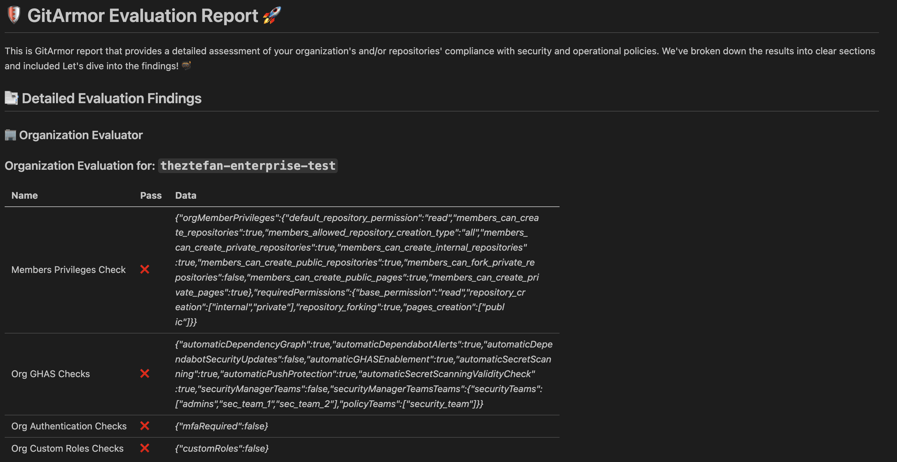
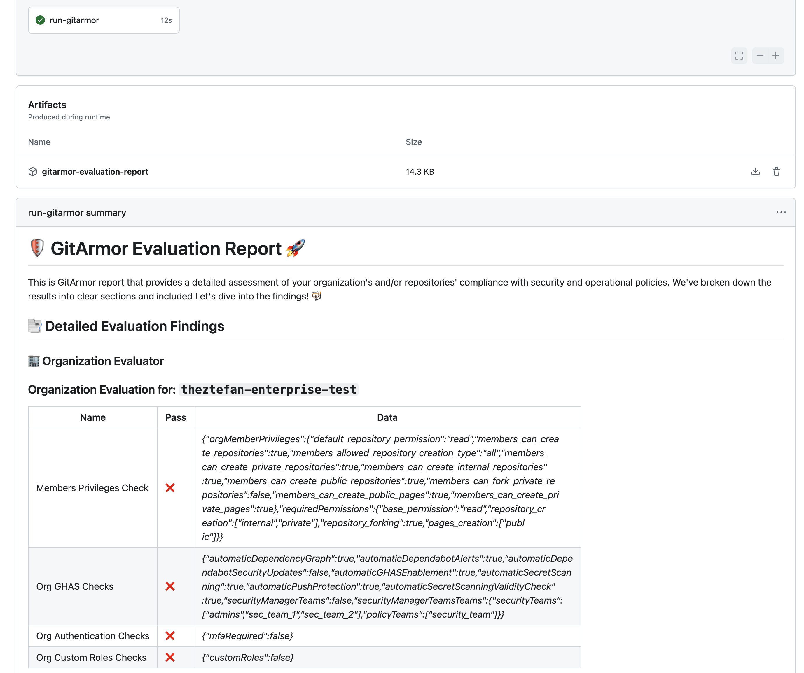

# GitArmor

<div style="background-color: white; padding: 10px;">
    
</div>

GitArmor is a handy tool that makes it easy to assess the secure setup of your developer platform. 

GitArmor intuitively transforms the security requirements and controls for your DevOps implementation into policies as code and enables you to run the checks against your GitHub environment.​

Here’s how GitArmor can be a game changer for you:
1. **Policy as Code** - Transform your DevOps platform security policies into GitArmor `yml` files. Stored centrally, these policies can be enforced with on-demand or periodic checks across your GitHub Organization, helping you pinpoint and prioritize areas for improvement. 🔒
2. **Security Assessments** - Perfect for Security Teams, GitArmor facilitates the reconnaissance phase of whitebox penetration tests by running against a project or organization. Armed with insights from the reports, you can strategize and execute targeted attacks on identified misconfigurations. 🎯
3. **Dev Team Setup** - Ideal for startups, a small development team can utilize GitArmor along with the default policy to ensure their GitHub repositories and organization are securely configured. 🎛️


GitArmor also maps the checks against the [SLSA.dev](https://slsa.dev/spec/v1.0/threats) and [MS DevOps threat matrix](https://www.microsoft.com/en-us/security/blog/2023/04/06/devops-threat-matrix/) to provide a comprehensive security posture for your GitHub environment. The threats and controls are documented in: 

- [Repository Threats](./policies/repository.threats.md)
- [Organization Threats](./policies/organization.threats.md)


## Getting Started

Developed in TypeScript, GitArmor is designed for use either in a terminal (CLI) or as a GitHub Action.

### CLI

Ready to get started with GitArmor? First, you'll need to either clone the repository or grab a release from our releases page.

#### Get the Code

Simply clone the repository:

```bash
gh repo clone dcodx/gitarmor
```
or
```bash
git clone https://github.com/dcodx/gitarmor.git
```

#### Requirements 

- Node v18 or higher
- npm or yarn

#### Install Dependencies

Install the necessary dependencies using `npm` or `yarn`:
```bash
npm install
```

#### Setup and Configure 

Create a `.env` file by using our sample configuration file `.env.sample`:
```text
TOKEN=ghp_TKN
LEVEL=repository_only # repository_only, organization_only, or organization_and_repository
REPO=repo-name
ORG=org-name
DEBUG=false
POLICIES_PATH=policies
```

where `LEVEL` is the scope of the checks:
- `repository_only` for repository-level checks
- `organization_only` for organization-level checks
- `organization_and_repository` for organization-level and repositorty_level checks for all the repos in the organization

Next, generate a Personal Access Token (PAT) from GitHub and input your settings into the `.env` file. Ensure your token has these permissions:
- `repo: admin`
- `org: admin`


#### Define Policies
The policies are written in YML and are stored in `repository.yml` and `organization.yml` files under the `policies` folder. Each policy file contains the checks for the respective scope.

- [Repository Policies](./policies/repository.yml)
- [Organization Policies](./policies/organization.yml)

The syntax for each policy can be found in the [Repository Policy README](./policies/repository.readme.md) and in the [Organization Policy README](./policies/organization.readme.md)


#### Fire Away!

To start the GitArmor check, run:
```bash
npm run start
```

#### Output

The results will be displayed in the standard output, with reports saved in both JSON and Markdown formats in the `output-report.json` and `output-report.md` files, respectively.



### GitHub Action 

GitArmor is published to the GitHub Marketplace and can be easily setup as a new workflow or integrated into an existing GitHub Actions workflow.


```yaml
jobs:
  run-gitarmor:
    runs-on: ubuntu-latest
...
    - name: Checkout policies
      uses: actions/checkout@v4
      with:
        sparse-checkout: policies
        repository: dcodx/gitarmor@main

    - name: Run GitArmor Action
      uses: dcodx/gitarmor@v1
      id: gitarmor
      #env:
      #   DEBUG: true
      with:
          repo: ${{ github.repository }}
          org: ${{ github.repository_owner }}
          token: ${{ TOKEN }}
          level: 'organization_only'
          policy-dir: './policies'
```

You can use the following example workflow files as inspiration for your own implementation:
- [GitArmor workflow for on-demand scans](.github/workflows/gitarmor-on-demand.yml)
- [GitArmor workflow for periodic scans](.github/workflows/gitarmor-periodic.yml)

For the token we recommend using [create-github-app-token](https://github.com/actions/create-github-app-token) and creating a GitHub App Installation Access Token.


#### Output

The action will generate a report in the standard output, with reports saved in both JSON and Markdown formats in the `output-report.json` and `output-report.md` files, respectively.

In an Action run, it will also `set-output` of the two reports into `check-results-text` and `check-results-json` for further processing in following steps or other jobs.

Lastly will also print the markdown report as a Job Summary.



---

# Next Steps

- [ ] Add Enterprise level checks 
- [ ] Extend checks at the organization level
- [ ] Enhance our documentation
- [ ] Launch the GitArmor Bot to automatically enforce GitArmor policies 

# Contributing

GitArmor is a [dcodx](https://dcodx.com/) project. Your contributions are welcome! 👐 Please visit our [CONTRIBUTING](.github/CONTRIBUTING.md) page for more details on how to become part of our vibrant community. ❤️

# License 

This project is released under the MIT OSS License. Please see our [LICENSE](LICENSE) for more information. 
